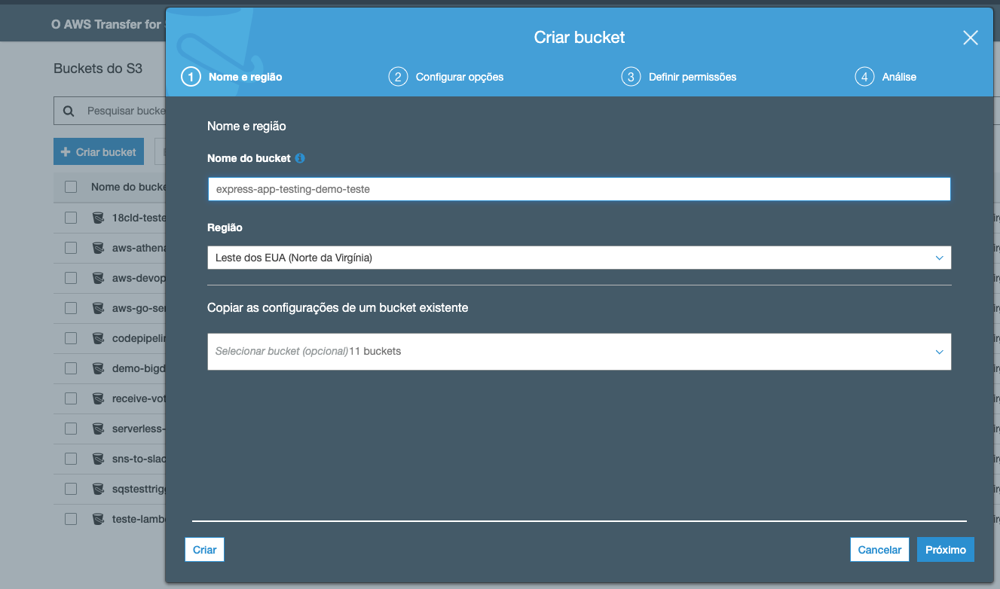
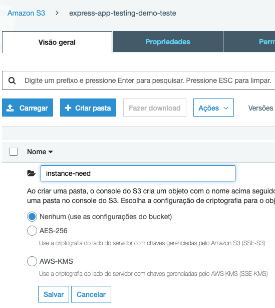

## Montar um delivery continua com AWS CodePipeline , AWS CodeDeploy, Terraform, e Docker

1. No console AWS crie um bucket S3 com o nome 'express-app-testing-demo-<NOME DIFERENCIANDO>'. Coloque no final o que quiser, vale lembrar que nomes de buckets são unicos em toda a AWS não só na conta em questão.
   
2. Após colocar o nome pode clicar direto em criar no canto inferior esquerdo.
3. Após criado, entre no bucket, vá na aba `Propriedades` e clique em `Controle de Versão`
4. Habilite essa propriedade para que o codePipeline possa identificar uma nova versão dos arquivos
   
5. Crie uma pasta no bucket com o nome 'instance-need'
   
6. Dentro da pasta recem criada crie 3 pastas
   1. `.ssh`
   2. `.aws`
   3. `prod`
   
7. Dentro da pasta .aws, coloque os arquivos `credentials` e `config` que estão na sua maquina virtual.
8. Dentro da pasta .ssh, coloque a pem criada para acessar as maquinas.
9. Não coloque nada dentro da pasta prod por enquanto.
10. Caso facilide, utilize comandos como esses direto da VM:
    ```
    aws s3 cp ~/.aws/config s3://express-app-testing-demo-teste/instance-need/.aws/config
    aws s3 cp ~/.aws/credentials s3://express-app-testing-demo-teste/instance-need/.aws/credentials
    aws s3 cp fiap-18cld.pem s3://express-app-testing-demo-teste/instance-need/.ssh/fiap-18cld.pem
    ```

    Só não esqueça de trocar o nome do bucket
11. Na maquina virtual vá até onde esta o projeto do git e executem o comando `git fetch && git checkout deploy-stack` para mudar a branch do repositório.
12. Dentro do arquivo `buildspec-deploy.yml` mude o nome dos buckets para o que criou. Procuro por S3 no arquivo para facilitar.
13. 
